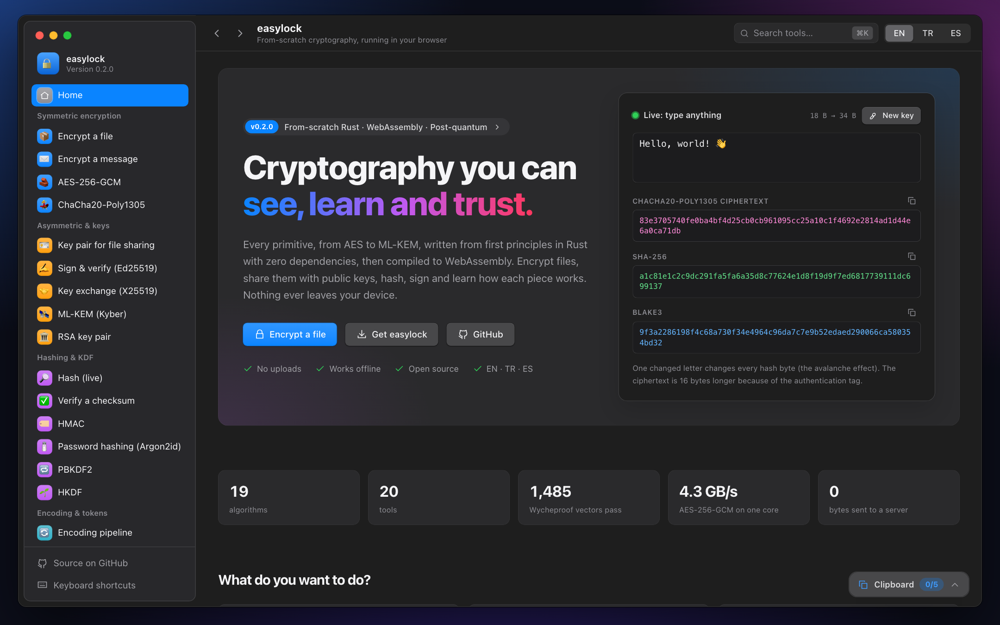
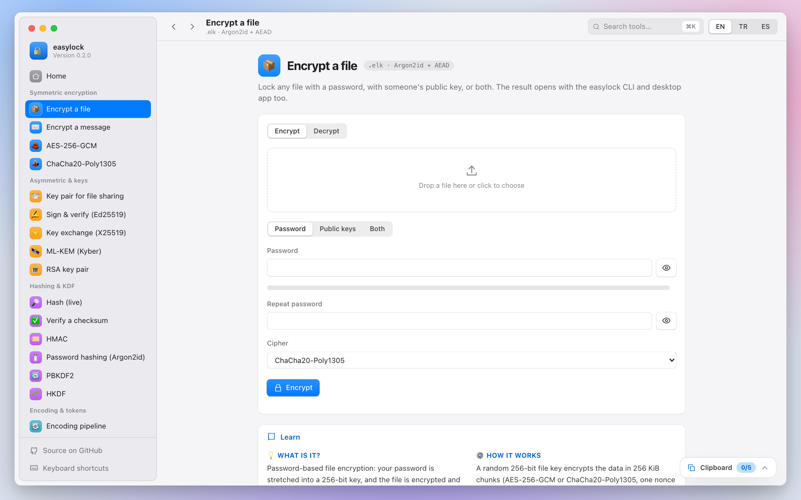
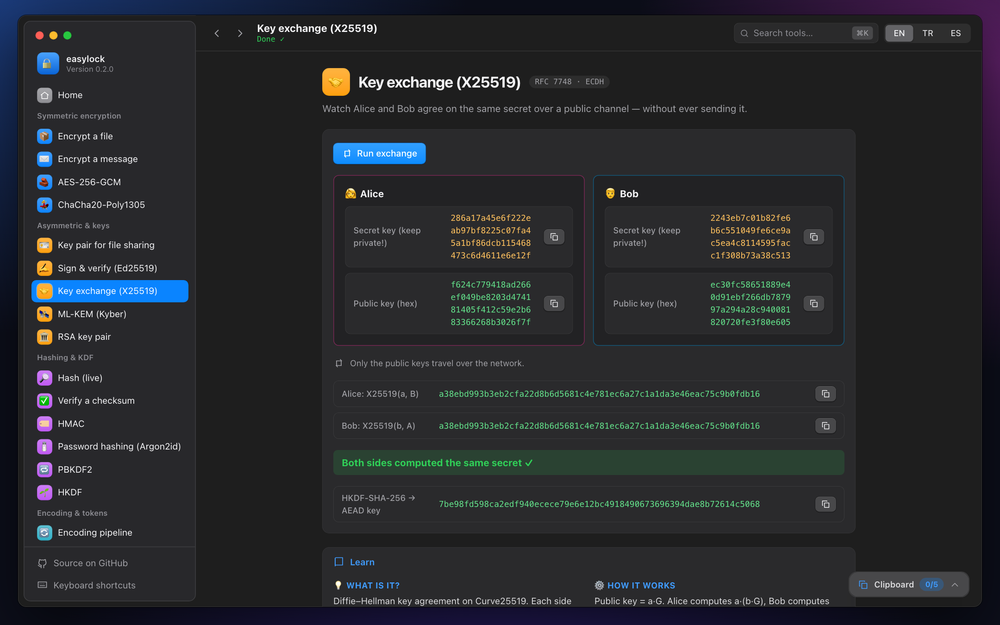
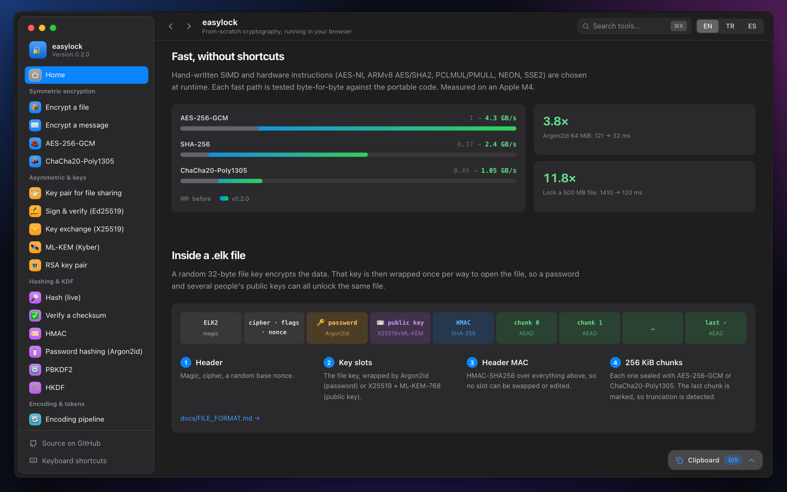
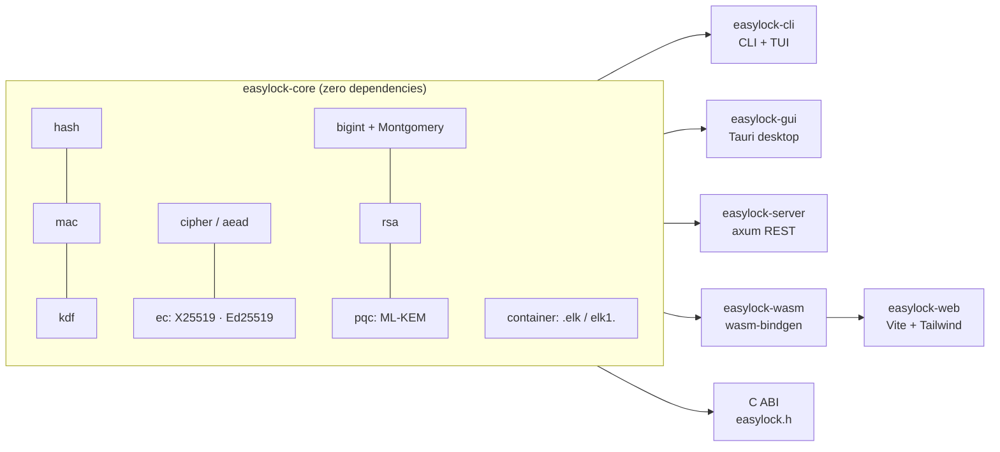

<div align="center">

<a href="https://zlixas.github.io/easylock/"></a>

<p>
  <a href="https://github.com/zlixas/easylock/releases/latest"></a>
  <a href="https://github.com/zlixas/easylock/actions/workflows/ci.yml"></a>
  <a href="https://zlixas.github.io/easylock/"></a>
  <a href="#license"></a>
  <a href="rust-toolchain.toml"></a>
  
  
</p>

<h3>
  <a href="https://zlixas.github.io/easylock/">🌐 Open the web app</a>
  &nbsp;·&nbsp;
  <a href="#-install">⬇️ Install</a>
  &nbsp;·&nbsp;
  <a href="docs/FILE_FORMAT.md">📄 File format</a>
  &nbsp;·&nbsp;
  <a href="docs/ARCHITECTURE.md">🧭 Architecture</a>
</h3>

English · [Türkçe](README.tr.md) · [Español](README.es.md)

</div>

<br>

**easylock** is a cryptography toolkit written **from scratch in Rust**, with every primitive from AES to post-quantum ML-KEM
implemented from first principles and **zero dependencies**. The same engine powers a **command line**, a **terminal UI**,
a **desktop app** and a **website that runs entirely in your browser**, and all four share one encrypted file format.

<table>
<tr>
<td width="33%" valign="top">

### 📦 Encrypt anything
Files and whole folders, to a password, to other people's **public keys**, or both. Streams at multi-GB/s in constant memory.

</td>
<td width="33%" valign="top">

### 🛰️ Post-quantum sharing
Recipients use a hybrid **X25519 + ML-KEM-768** key, so recorded files stay safe even against a future quantum computer.

</td>
<td width="33%" valign="top">

### 🔐 Encrypted vaults
A folder where files **stay encrypted**. Names and sizes are hidden too, and it syncs safely through iCloud, Dropbox or Git.

</td>
</tr>
<tr>
<td valign="top">

### 🎓 Learn by doing
20 interactive tools with a **Learn** panel each (*what · how · when · pitfalls*) in English, Turkish and Spanish.

</td>
<td valign="top">

### ⚡ Seriously fast
Hand-written AES-NI / ARMv8, PCLMUL / PMULL, SHA-NI, NEON and SSE2 paths: **4.3 GB/s** AES-GCM, **2.4 GB/s** SHA-256.

</td>
<td valign="top">

### 🧪 Built to be checked
Official NIST/RFC vectors, **1,485 Wycheproof** edge cases, fuzzing, differential tests and signed, attested releases.

</td>
</tr>
</table>

<div align="center">
<a href="https://zlixas.github.io/easylock/"><picture><source media="(prefers-color-scheme: light)" srcset="docs/images/web-home-light.png"></picture></a>
<sub>A macOS-style app in your browser, in light and dark mode. The home page encrypts and hashes what you type, live, using the Rust engine compiled to WebAssembly.</sub>
</div>

> [!WARNING]
> **Educational and unaudited.** Every primitive is implemented from first principles and
> checked against official test vectors (NIST CAVP, FIPS 197/180-4/202/203, RFC 7748/8032/8439/9106 …) and Project Wycheproof.
> That is necessary, but it is **not enough** to make the code safe for production. Nobody has
> independently audited it. To protect real secrets, use a reviewed tool such as
> `age`, `ring`, RustCrypto, libsodium or aws-lc. See [SECURITY.md](SECURITY.md).

---

## Contents

- [Why easylock?](#why-easylock)
- [Install](#install)
- [Quick start](#quick-start)
- [What's inside](#whats-inside)
- [The four front-ends](#the-four-front-ends)
- [Performance](#performance) · [Quality & assurance](#quality--assurance)
- [Architecture](#architecture) · [Building & testing](#building--testing)
- [FAQ](#faq) · [Roadmap](#roadmap)
- [Contributing](#contributing) · [Citing](#citing) · [License](#license)

## Why easylock?

Most people use cryptography as a black box. easylock opens the box:

- **From scratch.** `easylock-core` has *zero* runtime dependencies. It implements SHA-2, SHA-3, BLAKE3, AES and
  its GHASH, ChaCha20-Poly1305, Argon2id, Curve25519, RSA with a constant-time big-integer engine, and the
  post-quantum ML-KEM, all in readable Rust.
- **Verified.** More than 170 tests check the code against published vectors, and it builds with no warnings under `clippy::pedantic`.
- **Explained.** Each tool on the website has a **Learn** panel with four parts: *what it is*, *how it works*,
  *when to use it* and *what to be careful about*. All of it is available in English, Turkish and Spanish.
- **Interoperable.** The CLI, the TUI, the desktop app and the website share one `.elk` file format. A file you lock in the terminal
  opens on the website, and a file you lock on the website opens in the terminal.
- **Private.** The website compiles the same Rust core to WebAssembly, so it never sends a byte to a server.

## Install

| Platform | Command line + terminal UI | Desktop app |
|---|---|---|
| **macOS** | `brew install zlixas/tap/easylock` | [Apple Silicon `.dmg`](https://github.com/zlixas/easylock/releases/latest/download/easylock-desktop-macos-arm64.dmg) · [Intel `.dmg`](https://github.com/zlixas/easylock/releases/latest/download/easylock-desktop-macos-x64.dmg) |
| **Linux** | `curl -fsSL https://raw.githubusercontent.com/zlixas/easylock/main/install.sh \| sh` | [`.AppImage`](https://github.com/zlixas/easylock/releases/latest/download/easylock-desktop-linux-x64.AppImage) · [`.deb`](https://github.com/zlixas/easylock/releases/latest/download/easylock-desktop-linux-x64.deb) |
| **Windows** | `irm https://raw.githubusercontent.com/zlixas/easylock/main/install.ps1 \| iex` | [Installer `.exe`](https://github.com/zlixas/easylock/releases/latest/download/easylock-desktop-windows-x64.exe) · [`.msi`](https://github.com/zlixas/easylock/releases/latest/download/easylock-desktop-windows-x64.msi) |
| **Browser** | nothing to install: **<https://zlixas.github.io/easylock/>** (works offline as a PWA) | |
| **Source** | `cargo install --git https://github.com/zlixas/easylock easylock-cli` | `cd crates/easylock-gui && cargo tauri build` |

The install scripts check the download against the release's `SHA256SUMS`, and the Homebrew formula pins its hashes.
Every release file is listed in the Ed25519-signed `SHA256SUMS` and has GitHub build provenance:

```sh
easylock verify --public "$(cat RELEASE_SIGNING_KEY.txt)" -S "$(cat SHA256SUMS.sig)" SHA256SUMS
gh attestation verify easylock-aarch64-apple-darwin.tar.gz --repo zlixas/easylock
```

> [!NOTE]
> The desktop apps are not code-signed by Apple or Microsoft yet. On macOS right-click → **Open** the first time;
> on Windows choose **More info → Run anyway**.

## Quick start

```sh
easylock tui                               # full-screen interactive UI
easylock lock taxes.pdf                    # → taxes.pdf.elk  (asks for a password)
easylock unlock taxes.pdf.elk              # → taxes.pdf
easylock lock ~/Photos --shred             # whole folder → Photos.elk, originals wiped

easylock identity                          # your key pair (X25519 + ML-KEM-768)
easylock lock report.pdf -r elkpub1…       # encrypt for someone, no shared password
easylock unlock report.pdf.elk             # opens with your identity
echo -n abc | easylock hash -a blake3
easylock password -n 3 -l 24 --symbols
easylock --lang es --help                  # English · Türkçe · Español
```

## What's inside

| Family | Algorithms | Specification |
|---|---|---|
| Hashing | SHA-256, SHA-512, SHA3-256/512, SHAKE128/256, Keccak-256, BLAKE2b, BLAKE3 | FIPS 180-4, FIPS 202, RFC 7693 |
| MAC | HMAC (any hash), Poly1305 | RFC 2104, RFC 8439 |
| KDF / passwords | Argon2id/i/d (PHC strings), PBKDF2, HKDF | RFC 9106, RFC 8018, RFC 5869 |
| AEAD | AES-256-GCM (AES-NI / ARMv8 and PCLMUL / PMULL), ChaCha20-Poly1305 | SP 800-38D, RFC 8439 |
| Ciphers | AES-256, AES-256-CTR, ChaCha20 | FIPS 197 |
| Elliptic curves | X25519, Ed25519 | RFC 7748, RFC 8032 |
| RSA | key generation, PKCS#1 v1.5, OAEP, CRT | RFC 8017 |
| Post-quantum | ML-KEM-512 / 768 / 1024 (Kyber) | FIPS 203 |
| Encodings | Hex, Base64, Base64URL, Base58, ROT13, chainable pipelines | RFC 4648 |
| Containers | `.elk` files and `elk1.` text tokens (Argon2id + chunked AEAD) | [docs/FILE_FORMAT.md](docs/FILE_FORMAT.md) |

Supporting pieces include `write_volatile` zeroization, `Zeroizing<T>` / `Secret<N>`, constant-time comparison and
selection, runtime CPU feature dispatch, a C ABI ([`easylock.h`](crates/easylock-core/include/easylock.h)) and
`criterion` benchmarks.

## The four front-ends

### 🌐 Website (WebAssembly)

<table>
<tr>
<td width="50%"></td>
<td width="50%"></td>
</tr>
<tr>
<td align="center"><sub>Encrypt a file to a password, public keys, or both</sub></td>
<td align="center"><sub>X25519 key exchange, step by step</sub></td>
</tr>
</table>

The website has 20 tools in five categories. Each one includes a *Learn* panel and runs entirely on your device.

| | Tools |
|---|---|
| 🔒 Symmetric | Encrypt a file (`.elk`, password and/or public keys) · Encrypt a message (`elk1.` token) · AES-256-GCM · ChaCha20-Poly1305 |
| 🔑 Asymmetric | Key pair for file sharing · Ed25519 sign & verify · X25519 key-exchange walkthrough (Alice ⇄ Bob) · ML-KEM · RSA-2048 |
| ⚡ Hashing & KDF | Live multi-hash · Checksum verifier (detects the algorithm) · HMAC · Argon2id hash & verify · PBKDF2 · HKDF |
| 🔄 Encoding | Encoding pipeline · JWT inspector (checks HS256/HS512/EdDSA signatures) |
| 🛡️ Utilities | Password generator · Password strength estimator · Random bytes / tokens / UUIDs / PINs / passphrases |

The site also has a command palette (<kbd>⌘/Ctrl</kbd>+<kbd>K</kbd> or <kbd>/</kbd>), keyboard shortcuts (<kbd>?</kbd>), a layout
that works on phones, an EN/TR/ES switch (<kbd>Alt</kbd>+<kbd>L</kbd>) and a floating clipboard that holds up to five recent results.
The clipboard is wiped when you close the tab or after 5 minutes idle.
The site is an installable **PWA** that works **offline**. It runs under a strict Content-Security-Policy with no third-party requests,
and the slow operations (Argon2, file encryption) run in a Web Worker so the page stays responsive.

### 🗄️ File encryption in depth

`easylock lock` is built for real-world use:

- **Streaming and multi-core.** Memory use is constant (≈120 MB, mostly Argon2) at any file size. Chunks are encrypted on all
  cores in a pipeline. A 500 MB file takes about 0.3 s before the final `fsync`.
- **Folders.** Whole folder trees go into a single `.elk` file. Extraction is hardened against path traversal.
- **Public keys.** `-r` encrypts to one or more people using an X25519 + ML-KEM-768 hybrid, so the files are post-quantum
  secure. You can combine `-r` with `--with-password`.
- **Safe by default.** Output goes to a temporary file and is renamed only after it has succeeded and been `fsync`ed.
  Existing files are never overwritten without `--force`. A wrong key leaves nothing behind.
- **`--shred`.** After a successful encryption, the originals are overwritten and removed.
- **Pipes.** Example: `tar c dir | easylock lock - -r KEY > backup.elk`.
- **Compatible.** The same files open on the website and in the desktop app, and old ELK1 files still decrypt.

The byte-level format is documented in [docs/FILE_FORMAT.md](docs/FILE_FORMAT.md).

### 🔐 Encrypted vault

A vault is a folder where files **stay encrypted**. File names, sizes and dates are hidden in an encrypted index,
and plaintext is never written into the vault.

```sh
easylock vault init ~/Private.vault                 # password and/or -r public keys
easylock vault add  ~/Private.vault taxes/ id.pdf --shred
easylock vault ls   ~/Private.vault
easylock vault cat  ~/Private.vault taxes/2025.pdf | open -f
easylock vault get  ~/Private.vault taxes -o ~/Desktop
easylock vault rm   ~/Private.vault id.pdf
easylock vault passwd ~/Private.vault -r elkpub1…   # re-key without re-encrypting any files
```

Vaults sync safely through Dropbox, iCloud or Git because every file is a separate, randomly named object.

### ⌨️ Terminal UI

```sh
easylock tui
```

The terminal UI is a keyboard-driven ratatui app with nine tools: live hashing, encode/decode, password generation, key pairs,
password-based text encryption, HMAC, Ed25519 sign/verify, an X25519 exchange demo and an about screen. Keys:
<kbd>↑↓</kbd>/<kbd>1–9</kbd> choose a tool, <kbd>Tab</kbd> moves between fields, <kbd>F5</kbd> copies,
<kbd>F2</kbd> switches the language (EN → TR → ES) and <kbd>F1</kbd> opens help.

### 💻 Command line

| Command | Purpose |
|---|---|
| `hash` | SHA-2/3, Keccak, BLAKE3 over stdin or files |
| `encode` / `decode` | chainable Hex/Base64/Base58/ROT13 pipelines |
| `encrypt` / `decrypt` | raw-key AEAD / CTR / XOR |
| `lock` / `unlock` | encrypt files **and folders** to a password and/or public keys (`.elk`) |
| `inspect` | show how an `.elk` file can be unlocked, no password needed |
| `identity` | create or show your public-key identity |
| `vault` | `init` · `add` · `ls` · `get` · `cat` · `rm` · `passwd` · `info` for an encrypted vault |
| `hmac` | keyed MACs |
| `kdf` | Argon2id / PBKDF2, with `--verify <PHC>` to check a stored hash |
| `password` | unbiased random passwords, with their entropy |
| `keygen` | Ed25519, X25519, ML-KEM-512/768/1024, RSA-2048 (`--json`) |
| `sign` / `verify` | Ed25519 signatures |
| `info` | version, active hardware backends, algorithm catalogue |
| `tui` | the terminal UI |

The CLI localizes everything: help text, clap's headings, errors and status messages. It picks the language from
`--lang en|tr|es`, then `LC_ALL`/`LANG`, and falls back to English.

```console
$ easylock --lang tr kdf -p hunter2
$argon2id$v=19$m=65536,t=3,p=4$…
$ easylock --lang es unlock secreto.elk -p mala
easylock: autenticación fallida: clave/nonce incorrectos o los datos fueron modificados
```

### 🖥️ Desktop app (Tauri v2)

```sh
cd crates/easylock-gui && cargo tauri build
```

The desktop app has four tabs: **Files** (drag-and-drop `.elk` encryption with streaming progress), **Hash**, **Convert** and
**Keys**. It calls `easylock-core` directly over Tauri IPC without going through HTTP, and it is available in EN, TR and ES.

There is also **`easylock-server`**, an `axum` REST API (`/v1/hash`, `/v1/aead/*`, `/v1/kdf/*`, `/v1/keygen`, …) that can
also serve the web dashboard.

## Performance

These are single-process numbers on an Apple M4, measured with `cargo bench -p easylock-core` and `time`. All of it is still from-scratch code with
no dependencies. The hardware paths use each CPU's own instructions, selected at runtime, and fall back to constant-time software.

| Operation | Before | Now | Technique |
|---|---:|---:|---|
| AES-256-GCM (256 KiB) | 1.0 GB/s | **4.3 GB/s** | 8-block interleaved AES-NI / ARMv8 AES, aggregated PCLMUL/PMULL GHASH (H¹…H⁸) |
| ChaCha20-Poly1305 (256 KiB) | 0.49 GB/s | **1.05 GB/s** | 4-block NEON / SSE2 ChaCha20, 64-bit-limb Poly1305 |
| SHA-256 (256 KiB) | 0.37 GB/s | **2.4 GB/s** | ARMv8 SHA2 / Intel SHA-NI instructions |
| Argon2id 64 MiB, t=3, p=4 | 121 ms | **32 ms** | lanes filled on multiple cores, no block copies |
| `lock` 500 MB file → /dev/null | 1.41 s, 1 GB RAM | **0.10–0.15 s, ~120 MB** | streaming, multi-core pipeline |
| `unlock` 500 MB file → /dev/null | 1.31 s | **0.18 s** | pipelined read-ahead, bulk zeroization |

Every fast path is checked against the portable implementation in a differential test, on ARM natively and on x86-64 under Rosetta and in CI.



## Quality & assurance

| Check | Where |
|---|---|
| Official test vectors (NIST CAVP, RFCs, FIPS) | `cargo test` |
| **Project Wycheproof**: 1,485 edge-case vectors | `crates/easylock-core/tests/wycheproof.rs` |
| Differential tests: every SIMD/hardware path vs. the portable code | unit tests, on ARM, x86-64 and portable builds |
| **Fuzzing** (cargo-fuzz): headers, chunk streams, archives, decoders, AEAD | `fuzz/`, 60 s per target in CI |
| Dependency audit: licenses, RustSec advisories, sources | `cargo deny check` in CI |
| Coverage | `cargo llvm-cov` summary in every CI run |
| Pinned CI actions and Dependabot | `.github/` |

Found a problem? See [SECURITY.md](SECURITY.md).

## Architecture



For a guided tour of the source, see **[docs/ARCHITECTURE.md](docs/ARCHITECTURE.md)**. It covers constant-time techniques, CPU
dispatch, how the big-integer engine works and where to start reading.

| Crate | Role |
|---|---|
| [`easylock-core`](crates/easylock-core) | All primitives, constant-time `BigUint<N>`, containers, FFI |
| [`easylock-cli`](crates/easylock-cli) | `easylock` binary: CLI + ratatui TUI, EN/TR/ES |
| [`easylock-gui`](crates/easylock-gui) | Tauri v2 desktop app |
| [`easylock-server`](crates/easylock-server) | REST API + static hosting |
| [`easylock-wasm`](crates/easylock-wasm) | WebAssembly bindings |
| [`easylock-web`](crates/easylock-web) | Browser front-end (vanilla JS, no framework) |

## Building & testing

```sh
cargo test   --workspace                  # 170+ tests, vector-backed
cargo clippy --workspace --all-targets    # clean under clippy::pedantic
cargo bench  -p easylock-core             # criterion benchmarks

# the website
cd crates/easylock-web
npm install
npm run wasm     # wasm-pack build of easylock-wasm
npm run dev      # http://localhost:5173
```

Release builds cover `x86_64`/`aarch64` Linux, Apple Silicon and Intel macOS, and `x86_64` Windows. CI runs fmt, clippy (pedantic) and the test suite on Ubuntu, macOS and Windows, plus WebAssembly, cargo-deny, fuzzing and coverage jobs.

## Documentation

| Document | |
|---|---|
| [docs/ARCHITECTURE.md](docs/ARCHITECTURE.md) | Design, module map, constant-time techniques |
| [docs/FILE_FORMAT.md](docs/FILE_FORMAT.md) | Byte-level spec of `.elk` files and `elk1.` tokens |
| [SECURITY.md](SECURITY.md) | Threat model, known limitations, how to report issues |
| [CONTRIBUTING.md](CONTRIBUTING.md) | Dev setup, coding standards, adding a primitive or a language |
| [CHANGELOG.md](CHANGELOG.md) | Release history |

## FAQ

<details>
<summary><b>Are my files uploaded anywhere when I use the website?</b></summary>

No. The Rust engine runs inside your browser as WebAssembly. The Content-Security-Policy only allows the site's own files,
no third-party code is loaded, and once visited the site works in airplane mode.
</details>

<details>
<summary><b>Can a file locked on the website be opened in the terminal (and vice versa)?</b></summary>

Yes. The website, CLI, terminal UI and desktop app all read and write the same `.elk` format, byte for byte.
</details>

<details>
<summary><b>What does "post-quantum" mean for public-key files?</b></summary>

Each recipient slot combines X25519 with ML-KEM-768 (FIPS 203) and derives the wrapping key from both shared secrets.
An attacker must break both, so a future quantum computer that breaks X25519 alone does not open the file.
</details>

<details>
<summary><b>How is this different from age or GPG?</b></summary>

`age` and GPG are mature, reviewed tools, and you should prefer them for real secrets. easylock exists to be **read and
learned from**: every primitive underneath is in this repository, readable, tested and explained, and the whole thing also
runs in a browser.
</details>

<details>
<summary><b>What happens if I forget my password?</b></summary>

The file cannot be recovered. That is the point. For important files, add your public key as a second way in:
`easylock lock file -r "$(easylock identity --show)" --with-password`.
</details>

## Roadmap

- [x] Streaming, multi-core `.elk` v2 with password and hybrid post-quantum recipients
- [x] Encrypted vaults · signed, attested releases for Linux, macOS and Windows · Homebrew
- [x] Offline PWA with strict CSP and Web Worker crypto
- [ ] Vault browser in the terminal UI and the desktop app
- [ ] BLAKE3 SIMD, faster field arithmetic for Curve25519
- [ ] Code-signed desktop builds
- [ ] An independent security review

Ideas and pull requests are welcome, see [Contributing](#contributing).

## Contributing

Contributions are welcome: new primitives, more test vectors, translations, documentation and bug reports.
Please read [CONTRIBUTING.md](CONTRIBUTING.md) and the [Code of Conduct](CODE_OF_CONDUCT.md).

## Citing

If easylock helps your teaching or research, you can cite it through [CITATION.cff](CITATION.cff). GitHub's
"Cite this repository" button uses that file.

## License

easylock is dual-licensed under either of

- Apache License, Version 2.0 ([LICENSE-APACHE](LICENSE-APACHE))
- MIT license ([LICENSE-MIT](LICENSE-MIT))

at your option.

<div align="center">
<br>
<sub>Made with 🦀 and a lot of test vectors · <a href="https://zlixas.github.io/easylock/">zlixas.github.io/easylock</a></sub>
</div>
